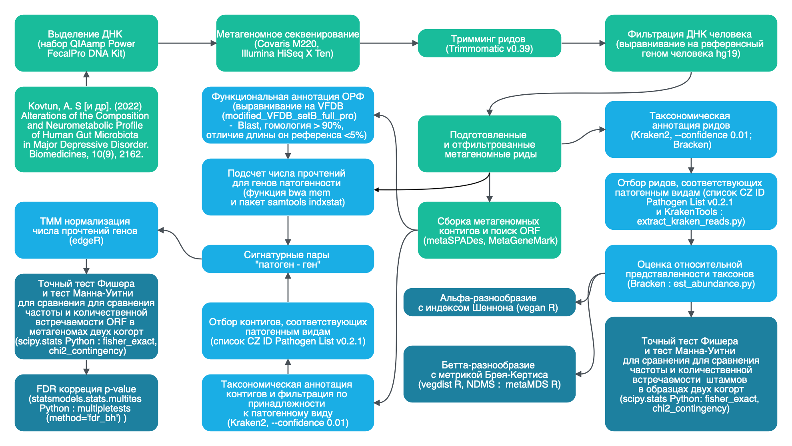

# Дизайн исследования

## Схема исследования

Общий план метагеномного анализа, проведенного в рамках данного исследования, представлен на @fig-pipeline. Этапы подготовки образцов, фильтрации данных и сборки метагеномных ридов в контиги, выполненные в предшествующем исследовании нашей лаборатории "Изменения состава и нейрометаболического профиля кишечной микробиоты человека при большом депрессивном расстройстве"[@kovtun2022], обозначены зеленым цветом. Голубым цветом обозначены этапы обработки данных, которые были реализованы непосредственно в данной работе. Синим цветом выделены методы статистического сравнения, примененные на различных этапах нашего анализа.

{#fig-pipeline}

## Подготовка и фильтрация метагеномных ридов

Первоначально, в рамках предшествующего исследования, из каждого образца фекалий была выделена общая геномная ДНК с использованием набора QIAamp PowerFecal Pro DNA Kit (Qiagen, Германия) в соответствии с рекомендациями производителя. Далее были созданы метагеномные библиотеки с использованием подхода "shotgun-sequencing". Данный подход включал случайное фрагментирование ДНК до средней длины 350 пар оснований с использованием Covaris M220 (Covaris LLC., США), секвенирование парных прочтений (paired-end reads) на платформе Illumina HiSeq X Ten (Illumina Inc., США) и последующий контроль качества с использованием FastQC v0.11.5 .

Для обеспечения высокого качества данных, исключения влияния артефактов секвенирования и контаминации ДНК хозяина, была выполнена строгая фильтрация ридов. В первую очередь, был произведен тримминг ридов с использованием Trimmomatic v0.39 с целью удаления низкокачественных участков и адаптеров. Затем, для удаления ридов, происходящих от ДНК человека, было проведено выравнивание ридов на референсный геном человека (hg19) с использованием Bowtie2 (версия 2.4.17). Риды, не картирующиеся на геном человека, были сохранены для дальнейшего анализа, что позволило сфокусироваться исключительно на микробном сообществе.

На заключительном этапе подготовки данных, риды были собраны в более длинные контиги с использованием metaSPADes v3.14.1, что позволило повысить точность идентификации генов в последующем анализе. И в них были идентифицированы ORF с помощью MetaGeneMark и сохранены в формате fasta.

Таким образом была сформирована коллекция метагеномных данных, включающая в себя образцы фекалий, полученные от пациентов с депрессией (группа PD) и здоровых добровольцев (группа HC).